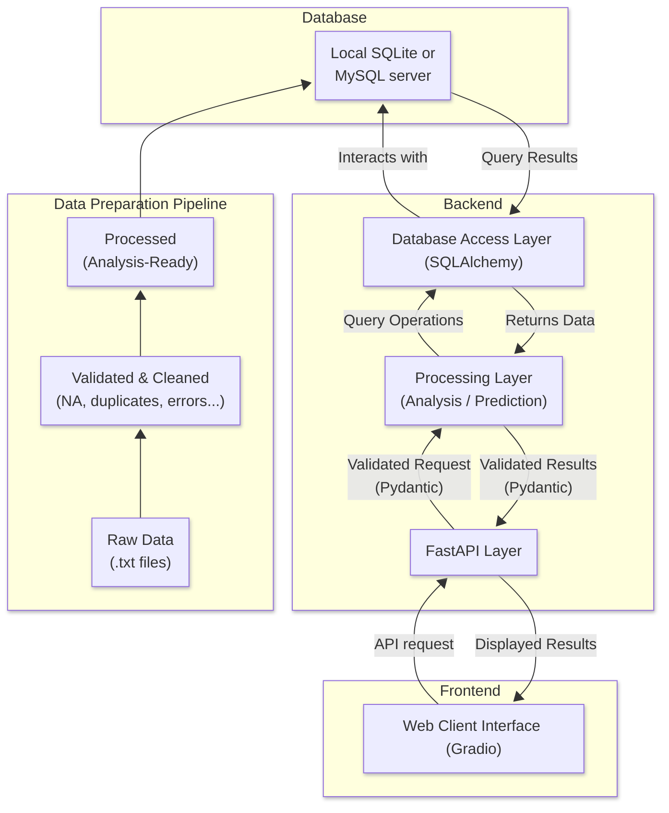
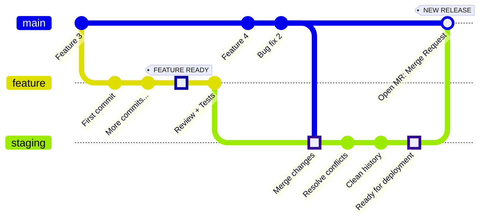

# France Property Insight: Analysis and Predictions

Website link to our app: <https://gpd-m2sep-france-property-insight.onrender.com/>

Predictive analysis application designed to help owners estimate their properties' values or future buyers to find and predict a property's value in the following years.

The predictive models will use Machine Learning and the dataset is from the French "Ministere de l'Économie, des Finances et de l'Industrie".  
Dataset used: ["Demandes de valeurs foncières"](https://www.data.gouv.fr/datasets/demandes-de-valeurs-foncieres/)

## Table of Contents

- [France Property Insight: Analysis and Predictions](#france-property-insight-analysis-and-predictions)
  - [Table of Contents](#table-of-contents)
  - [Database](#database)
  - [Data Flow Diagram (DFD)](#data-flow-diagram-dfd)
  - [Repository Structure](#repository-structure)
  - [Installation and Usage](#installation-and-usage)
    - [No installation: website link](#no-installation-website-link)
    - [Method 1: with Docker Desktop](#method-1-with-docker-desktop)
    - [Method 2: by installing Python and uv manually](#method-2-by-installing-python-and-uv-manually)
  - [Current state](#current-state)
    - [Changelog](#changelog)
  - [Git Workflow Diagram](#git-workflow-diagram)
  - [Contributors](#contributors)
  - [License](#license)

## Database

Dataset used: [Demandes de valeurs foncières](https://www.data.gouv.fr/datasets/demandes-de-valeurs-foncieres/)

Public official dataset from the French government. Tracks real estate transactions over the French territory from 2020 to 2024.  
More infos (origin, localization, methods, variable glossary...) in docs/metadata-fr.pdf

## Data Flow Diagram (DFD)

Prettier PNG version available at docs/data-flow.png



## Repository Structure

- **.devcontainer/** contains Docker setup files

- **data/**
  - **raw/** raw data
  - **cleaned/** validated by Pydantic schemas & cleaned (duplicates, missing values, renaming...)
  - **processed/** ready for analysis, visualization, modeling

- **docs/**
  - **references/** references from teacher and past projects

- **src/** contains the python functions and scripts to run our app, analysis and models
  - **analysis/**
  - **data_pipelines/** data import, format conversion, validation, cleaning, filtering
  - **interface/**
  - **models/**
  - **utils/**
  - main.py

- **tests/**
  - **behave/** behave tests
  - **unit/** unit tests

- .gitignore: Prevents unwanted files from being tracked by git.
- .gitlab-ci.yml
- .pre-commit-config.yaml
- .python-version
- pyproject.toml: Project metadata, dependency ranges, and command lines shortcuts (project.scripts).
- README.md: This very same file.
- uv.lock: Lockfile with exact dependency versions for reproducibility.

## Installation and Usage

### No installation: website link

Website link to our app for immediate use: <https://gpd-m2sep-france-property-insight.onrender.com/>

2 ways to install: with or without Docker.  
The second method, while less reliable because of manual installation of python and uv, is much faster.

### Method 1: with Docker Desktop

1. Install **Docker Desktop**: From [www.docker.com](https://www.docker.com/products/docker-desktop/)  
Make sure Docker Desktop is **running** before continuing.

2. Clone the Git repository to your local machine:

```bash
git clone https://gitlab-mi.univ-reims.fr/phan0005/gpd-m2sep-france-property-insight.git fpi
```

3. Navigate to the cloned directory:

```bash
cd fpi
```

4. Build our app (Docker Desktop has to be running):

```bash
docker-compose -f .devcontainer/compose.yaml up -d --build
```

5. Run our app:

```bash
docker exec -it fpi-devcontainer uv run fpi
```

### Method 2: by installing Python and uv manually

1. Install **Python 3.13**: From [Python.org](https://www.python.org/).

2. Install **uv**: From [https://docs.astral.sh/uv](https://docs.astral.sh/uv/getting-started/installation/).

3. Clone the Git repository to your local machine:

```bash
git clone https://gitlab-mi.univ-reims.fr/phan0005/gpd-m2sep-france-property-insight.git fpi
```

4. Navigate to the cloned directory:

```bash
cd fpi
```

5. Run our app (first launch always takes more time because of building time)

```bash
uv run fpi
```

6. The app will run on local URL: `http://127.0.0.1:7860`

## Current state

CURRENT STATE: Sprint 1  
This project will go through 5 sprints with reviews and demonstration.

### Changelog

**Sprint 1**

Major changes:

- Hosting the app online
- Web client interface with Gradio
- Deployment via Docker
- gitlab CI setup + runners (mypy, pip-audit, pytest, behave)
- pre-commit setup + ruff (lint and format)

Minor changes:

- uv run shortcuts in .toml scripts
- function to sample original data

## Git Workflow Diagram

Prettier PNG version available at docs/git-mr-workflow.png

Noone is allowed to push on main, any development has to be done on a separate branch.  
When ready, the features are merged on staging, a branch used as a safety layer, before being merged to main.



## Contributors

- Daniel PHAN: Product Owner/Scrum Master
- Perle NDAYIZEYE: Data Analyst
- Kim Ngan THAI: Frontend/UI
- Nicolas COLLIN: Data Engineer
- Claudy LINCY: Data Scientist

This is an academic project for our Master 2 Statistique pour l'Évaluation et la Prévision 2025-2026 at the University of Reims Champagne-Ardenne.

## License

This project is licensed under the **MIT License**: you’re free to use, modify, and share it, with attribution and no warranty.
