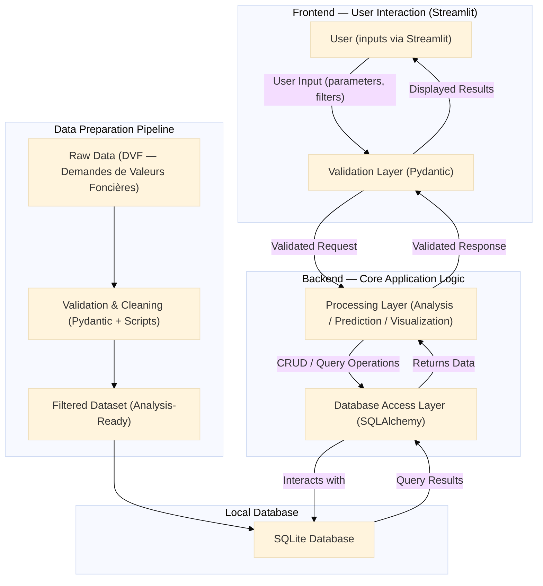

# France Property Insight: Analysis and Predictions

Academic project in Master 2 Statistique pour l'Evaluation et la Prevision 2025-2026.

This is a predictive analysis application developped fully in Python to help owners estimate their properties' values or future buyers to find and predict a property's value in the following years.

The predictive models will use Machine Learning and the dataset is from the French Ministere de l'Economie, des Finances et de l'Industrie.
Dataset used: [Demandes de valeurs foncieres](https://www.data.gouv.fr/datasets/demandes-de-valeurs-foncieres/)

## Table of Contents

- [France Property Insight: Analysis and Predictions](#france-property-insight-analysis-and-predictions)
  - [Table of Contents](#table-of-contents)
  - [Database](#database)
  - [Data Flow Diagram (DFD)](#data-flow-diagram-dfd)
  - [Repository Structure](#repository-structure)
  - [Installation and Usage](#installation-and-usage)
  - [Testing](#testing)
  - [Current state \& Potential improvements](#current-state--potential-improvements)
  - [Contributors](#contributors)
  - [License](#license)

## Database

Dataset used: [Demandes de valeurs foncieres](https://www.data.gouv.fr/datasets/demandes-de-valeurs-foncieres/)

Public official dataset from the French government. Tracks real estate transactions over the French territory from 2020 to 2024.
More infos (origin, localization, methods, variable glossary...) in docs/metadata-fr.pdf

## Data Flow Diagram (DFD)



## Repository Structure

- **data/**
  - **raw/** raw data
  - **validated/** validated by pydantic schemas
  - **cleaned/** cleaned (duplicates, missing values, renaming...)
  - **filtered/** ready for analysis, visualization, modeling

- **docs/**
  - **references/** references from teacher and past projects

- **src/** contains the python functions and scripts to run our app, analysis and models
  - **analysis/**
  - **data_pipelines/** data import, format conversion, validation, cleaning, filtering
  - **interface/**
  - **models/**
  - **utils/**
  - main.py

- **tests/** contains our unit tests made with pytest

- .gitignore: Prevents unwanted files from being tracked by git.
- .python-version
- pyproject.toml: Project metadata, dependency ranges, and command lines shortcuts (project.scripts).
- README.md: This very same file.
- uv.lock: Lockfile with exact dependency versions for reproducibility.

## Installation and Usage

**Requirements**

- **Python 3.13**: From [Python.org](https://www.python.org/).
- **Python project manager uv**: From [docs.astral.sh/uv/getting-started/installation/](https://docs.astral.sh/uv/getting-started/installation/).

**Installation**

1. Clone the Git repository to your local machine:

```bash
git clone https://gitlab-mi.univ-reims.fr/phan0005/gpd-m2sep-france-property-insight.git
```

2. Navigate to the cloned directory:

```bash
cd gpd-m2sep-france-property-insight
```

3. Run our app

```bash
uv run main
```

## Testing

To run our unit tests:

```bash
uv run python -m pytest
```

To run our doctests as well:

```bash
uv run python -m pytest --doctest-modules
```

## Current state & Potential improvements

CURRENT STATE: Sprint 1
This project will go through 5 sprints with reviews and demonstration.

## Contributors

- Daniel PHAN: Product Owner/Scrum Master
- Perle NDAYIZEYE: Data Analyst/Data Viz
- Kim Ngan THAI: Front End/Data Viz
- Nicolas COLLIN: Data Engineer
- Claudy LINCY: Data Scientist

**HONORABLE MENTIONS**

- Hideo Kojima

## License

This project is licensed under the **MIT License**: you’re free to use, modify, and share it, with attribution and no warranty.
